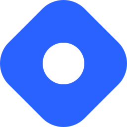

<h1 align="center">Namaskaram 🙏 , I'm Lokesh</h1>
<h3 align="center">I am a Blockchain Developer who loves building Decentralized Applications and systems using Blockchain Technology. I am always looking to learn and expand my skill set.</h3>

- 🔭 I’m currently **Building GameFi Infrastructure** at [LYNC](https://www.lync.world/)

- 💬 Ask me about **Blockchain, Defi, NFTs, Solidity, JavaScript, TypeScript, Rust etc.**

- 🌱 I’m currently learning **how to leverage Rust and TypeScript in different projects.**

- 📝 I write articles on [blog.lokeshkr.com](https://blog.lokeshkr.com)

- 📫 How to reach me **lokeshkumar636@yahoo.com**

<h3 align="left">Social links:</h3>

<table>
  <tr>
    <td></td>
    <td></td>
  </tr>
</table>
